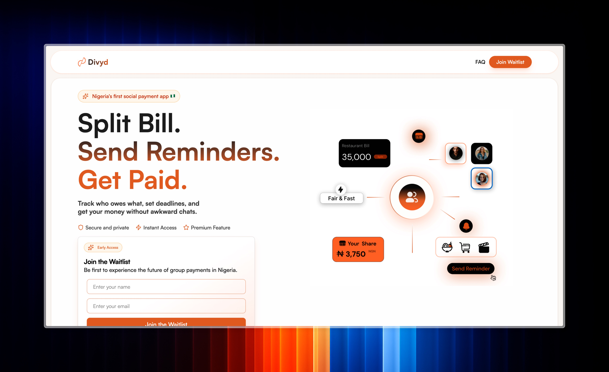

### 📁 `README.md`

# Divyd Landing Page 🚀

A sleek, responsive, and animated landing page built with **React**, **TypeScript**, and **Tailwind CSS** for the upcoming Divyd platform.

## 🔥 Features

- ⚡ Modern UI with smooth animations
- 🎨 Fully responsive and mobile-first design
- 🖋 Custom fonts (UEFA & Satoshi)
- 🌐 Route-aware navigation (`react-router-dom`)
- 📜 Clean, scalable code structure with utility-first styling
- 🔒 Google reCAPTCHA v3 integration (stealth mode)

## 🛠️ Tech Stack

- **React** + **TypeScript**
- **Tailwind CSS**
- **React Router**
- **Custom CSS animations**
- **Google reCAPTCHA v3**

## 📸 Preview



## 🚀 Getting Started

1. **Clone the repository**

```bash (SSH)
git clone git@github.com:Divyd-Africa/divyd-landing-page.git
cd divyd-landing-page
````

2. **Install dependencies**

```bash
npm install
# or
yarn install
```

3. **Run locally**

```bash
npm run dev
# or
yarn dev
```

4. Open [http://localhost:8085](http://localhost:8085) to view it in the browser.

## ⚙️ Folder Structure

```
src/
│
├── assets/             # Fonts, images, styles etc.
├── components/         # Reusable UI components (e.g., NavBar, Footer)
├── pages/              # Route-based pages (e.g., FAQ.tsx)
├── App.tsx             # Main App component
├── main.tsx            # Entry point
```

## 🧠 Notes
* The navigation dynamically adapts based on current route (e.g. shows "Back Home" if not on `/`).
* reCAPTCHA badge is hidden intentionally via CSS, make sure to comply with Google’s policies if going to production.

## 📄 License

MIT License. Use responsibly.

---

Made with 💻 + ☕ by the Divyd team.
